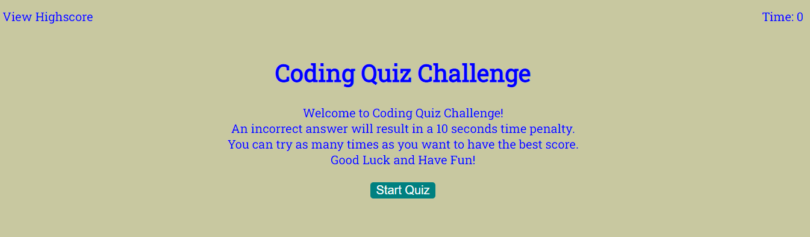
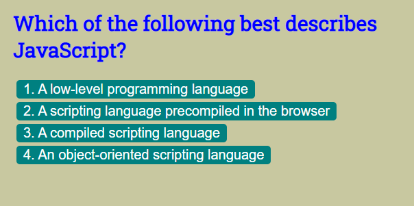
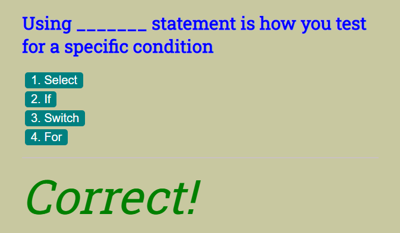
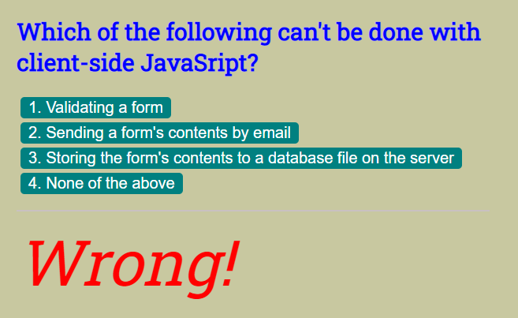
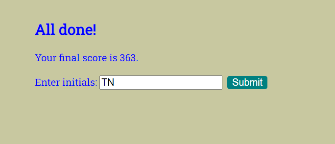

# Web APIs - Code Quiz
This is a Code Quiz web page that is primarily built using JavaScript.

 [Code Quiz](https://tringuyen1086.github.io/code-quiz-basis/)
 
## Description:
A typical coding assessment is a combination of multiple-choice questions and interactive coding challenges.

## Instruction 
- Press the "Start" button to play 
- Race against the timer to complete the quiz as best as you can; answering incorrectly will deduct time!
- When you're done, you will be prompted to enter your initials which will be saved on the scoreboard.

## Images:

